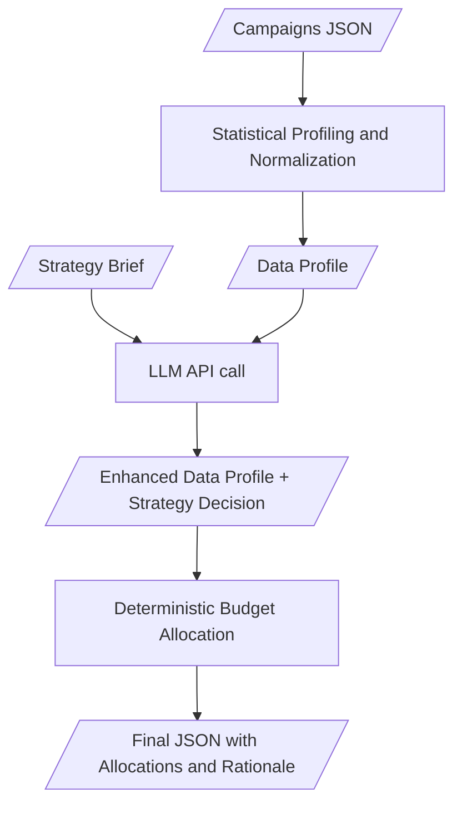
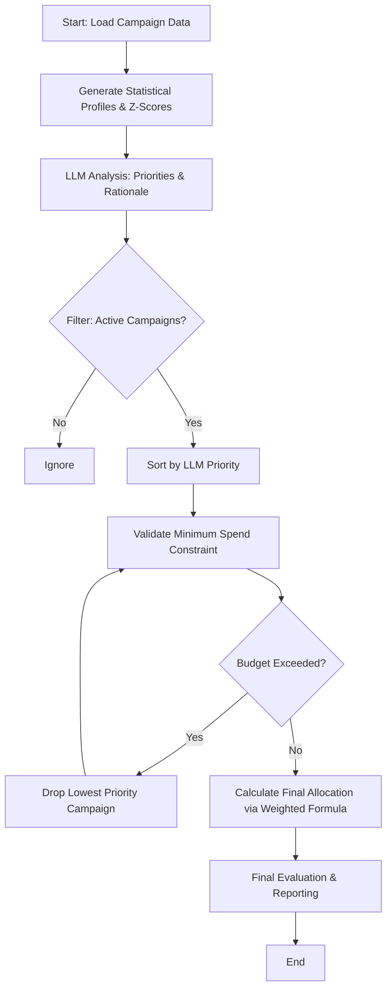

# Intelligent Budget Allocation System for Advertisment Campaigns
date: 2026/4/22\
version: 0.0.2\
author: Piotr Sziroky

---
## Table of Contents
- [Introduction](#introduction)
- [Rules & Principles](#rules--principles)
- [Data](#data)
- [Data Flow Diagram](#data-flow-diagram)
- [Architecture Overview](#architecture-overview)
- [AI layer](#setup--requirements)
- [Results & Plans](#results--plans)
- [How to run it?](#how-to-run-it?)
- [Technology](#Technology)


## Introduction
Without oxygen there is no fire, same as without money there is no campaigns.\
Just like fire if you want to cook over it you need to control how much wood you will use.\
If You are using too much (wood) you burned the stew and you just used a lot of it for nothing.\
If you are not giving the fire enough fuel, you will lose the heat or in the worst case you end with just ashes.

This analogy I think its very good when it comes to advertisment campaigns. If we want to have successful campaigns we need to control how much money we allocate to each campaign and make sure that we are getting the best results.

But honestly what does it means the best results?

I want to propose a prototype for the campaign allocation system that is a combination of statistics, LLM & machine learning.

## Rules & Principles
The Buisness perspective set as some rules and principles for the system. I'll identify them as a crucial critical instructions I need to follow.

**Opportunity Cost**

If this would be simple as *"put money into the higher ROAS"* there would be no need for inteligent system rather a *"if"* statement.

Yes, high ROAS indicates that we are getting more revenue but also we should look at different metrics!

Why putting more money into high *ROAS* campaign that is not **converting, the CPA is extremly low and audience is saturated.

I assume you can have high *ROAS* but at the same time the campaign is no longer "attracting" anyone so we need to keep in mind this is not an simple thing.

**Diversification vs Concentration**

We can put all the budget into one efficient campaign or diverse the budget into new ones.\
Both of this startegy have theirn pros and cons

The system will read the client instructions based on this will propose to allocate the budget. To see if we are not "tied" to much into one platfrorm the authors propose\
$Herfindahl–Hirschman \space Index$ (wchich calculates the concentration of budget among the campaignes).

There is also an Threshold of $0.25\space{HHI}$ that means we put a lot of trust in one advertisment platform the safest is to have a $HHI \space \frac{1}{n}$ but is it the smartest decision?

Sometimes the risk will be worth it and it depends of the strategy.

We need to give the human-in-the-loop to make decision give him insights on how concentrated is the budget in this strategy what risk it has.

3. **Risk Menagment**
#### Volatility
Marketing like the stock its more about tommorow than today.\
Thats why we need to carefully look at the trend not just values.\
This makes total sense you can have two campaign, same ROAS but different trend.\
Imagine highly saturated almost never clickd agian campaign that made a lot of money in the past but in case of tommorow it just burns the budget.

Putting the money in a campaign that generates more cost than revenue, simply don't make any sense.

#### Platform Concentration
No single platform should receive more than 55% of total budget unless the output explicitly justifies the exception.\
Breaching this threshold is a risk, not a default.\
The reason of it is that you dont want to depend only on one specific platform because the platform can have f.e a freeze or would go down and same your campaigns.

#### Minimum viable spend
The money we can put into campaign is limited both from the top and bottom level.\
This is represent by min_viable_spend in the data.\
We should flag if the mininimum is not met and recomend to stop it completly not to put money that statistacly doesnt make any sense. 


## Data 
It all starts with the data and we are dealing with two kinds of them:
- Structured (*campaigns.json*),
- Unstructured (*startegy_brief.txt*)

Let's start with understanding what exactly is represented in each one:

### JSON Campaigns
#### Marketing Indices

- *ROAS - Return of Ad Spend*:\
In other terms how much we spend vs how much ad revenue we get.\
To calculate we will use simple $ROAS = \frac{revenue}{spend}$.\
Higher Roas we get the campaign is more feasible.

- *CPA - Cost Per Action*:\
This metric describe the cost of user performing action an specific action.\
This cost shows the real cost of making the user perform a specific action.

- *Conversion Volume*:\
The number of conversions that occurred during the period campaign was active (assumption!).\
A conversion can be defined as the rate of turning user to an customer using the advertisment.

- *Audience Saturation Signal*\
A metric decribing how much the audience is familiar (in worst case fatigue) with the campaign.\
Basically if higher it means the campaign is more likely to get less clicks and conversions.\
Roughly said: it's getting boring. 

#### Trend Data

- *4 Weeks ROAS Trend:*\
This metric describes if the ROAS is increasing, decreasing or flat over the last 4 weeks.

#### Descriptive Fields

- *Campaign ID*\
Name of the campaign.

- *Platform*\
Platform of the campaign (Google, Meta, TikTok)

- *Campaign Type*\
The type of the campaign (retargeting, brand, prospecting)

#### Financial Fields

- *Current Weekly Spend*\
The amount of weekly spend budget.

- *Platform Level Budget Cap*\
The maximum budget that can be spent on this platform.

- *Minimum Viable Spend*\
The minimum amount of money that needs to be spent in order for the campaign to be viable.

### Strategy Brief
This is a document written by someone who is responsible for the marketing strategy and budget allocations. The core here is to understand this brief can contains ambigous meaning and from logical perspective can be tricky (f.e add more money to TikTok. Put down campaigns with CTA below 25. One campaign can be described by both of this sentences).

Since even unstructured data holds information im proposing to turn them into strucered object. The fields i came with will be described below but turning them into pydantic model is ready to adjust by someone adding more informative fields. 

## Data Flow Diagram



## Architecture Overview

Let's talk what this system will be and won't be whats the major risks and major cappabilities.

### What it will be?
This will be a Sequential system ([check here](#next-steps)) that will utilize the power of Language model (*Gemini*) to extract information from the brief and based on the note and json data decide and rationale the strategy. 

Based on this the budget will be allocated using statistic and weighted equation. This eqution will be described below same as the capability to train a regression model to adjust it.

Next is the evaluation layer that tests the output against:
- **Allocation accuracy**: within ±10% of ground-truth spend per campaign 
- **Action agreement**: does the system agree on scale/hold/reduce/pause? 
- **Risk flag recall**: did the system catch the same risk flags a human identified? 
- **Total budget constraint**: hard fail if total ≠ $85,000

If the system fail it should have the option to fallback to LLM again but using external API provider could be risky and expensive if model is not evaluated against halucination.

That's of course the plan the system that can be seen here is not a perfect and stable system.

### System Architecture & Allocation Logic

The system follows a hybrid approach, combining quantitative statistical analysis with qualitative LLM-driven insights to perform deterministic budget allocation.

---

### The Flow of the System

1. **Data Ingestion & Parsing** The process begins by loading raw campaign performance data and parsing it into structured internal objects for processing.

2. **Statistical Profiling** For each campaign, we generate initial profiles based on:
   * **Quantitative Metrics:** Calculating $z$-scores for key performance indicators (KPIs).
   * **Descriptive Categorization:** Translating raw numbers into qualitative descriptors to provide better context for the LLM.

3. **LLM-Driven Strategic Analysis** Initial profiles and strategy briefs are processed by an LLM to enrich the data with:
   * **Strategic Priority:** Categorical ranking based on business goals.
   * **Rationale:** Reasoning behind the assigned priority.
   * **Strategy Insights:** Qualitative guidance derived from the brief.

4. **Deterministic Budget Feasibility** Unlike stochastic models, the system uses a deterministic logic gate. We filter for active (non-paused) campaigns and validate them against hard constraints.

5. **Priority-Based Sorting** Campaigns are organized in a descending queue based on the **LLM Priority** score to ensure high-value objectives are funded first.

6. **Minimum Spend Validation** The system attempts to allocate the "Minimum Spend" for each campaign. If the cumulative sum exceeds the total budget (e.g., 85,000), the lowest-priority campaigns are iteratively removed until the constraint is met.

7. **Dynamic Weighting & Weighted Allocation** The remaining budget is distributed using a multi-factor scoring formula:
   $$Score = ((w_1 \cdot ROAS) - (w_2 \cdot CPA) + (w_3 \cdot (1 - Saturation))) \cdot LLM\_Priority \cdot Trend\_Multiplier$$
   *Where $w_n$ represents the relative importance of each metric.*

8. **Final Evaluation & Output** The system performs a final integrity check to ensure the total allocation equals 100% of the available budget and outputs the final distribution.

---

### System Flow Diagram



## AI Layer
The main AI task is to change the unstructured brief into structured object that represents informations that van be read from the file. The fields AI are extracting from the brief:
- is_mentioned - if the brief mentioning a particular campaign
- quote - the quote in which the campaign is mentioned
- semantic analysis - semantic analysis of the quote
- priority - a LLM score to asign the priority (some campaigns can be more imprtant from others)

To check the exact fields that are extracted using AI check `CampaignAnalysisSchema` in `llms/GoogleLLM.py`

This is used to collect a **Structured Output**

This model can be extended with more specific advanced fields and also it needs to be ensured that model is also analyzing the numerical fields.

The AI layer due to cost and sprint was limited to one but propably it could levarage a MOE approach (not exactly agent) but one LLM analyzing brief, one analyzing the campaogin stats and one that is merging their insights.

Now due to cost im processing all campaigns in single call but it definetly could be utilized with multi turnes and also use function calling to compare the campaigns between each other.

## Results & Improvments
### Results
This rapid task resulted in very early stage POC of a allocation system. It proves the JSON and LLM text analysis can be used to create a budget allocation system. The contract first development ensures that the data flow is not ambigous and structured response do not return anything that could crash the program. Allocation using a deterministic approach is very safe but propably not the best since the queing method of droping the last campaign is aggresive and often not very feasible as well as it can drop the campaigns that LLM assign the same priority score.

Even if the Evaluation layers are implemented they should be designed to actually perform a feedback to the system for now its just informative but in future should be more actionable.

The very last is that the evaluation shows the results are bad and not reliable the amount, campaign and flags are not identified well. The flag system is the first thing to be repaired.

Lesson for future designing a system with a AI pair programmer is a SOTA thing but deadlines eager to rush with function creation and the process is not fully controlled (you understand the functions but not the flow). For production and even MVP thats not acceptible but that was only way for me to acomplish this on time (basically in one day).

### Next Steps


1. **Clean the code and optimize it** - review, clean up and optimize the functions after to many vibe coded functions.
2. **Review the flagging system** - check why the flags are not identified (propably because they are assigned after budget allocation but the allocation method is handling high HHI, Overspends)\
3. **Review the Data & system flow** - to better understand possible data leakages
4. **Invent something better than a formula or rearange it** - because its not great solution (in some cases it recommends puttin 82 000 $ into one campaign - propably no up limited check.)
5. **Implement Nemo Agent Toolkit** - to be not limited to one API provider.
6. **Implement and test** if the **polynomial regression model** can be utilized to control the equation. 

## How to run it?
Requirements: `UV`, `Python`

To run the code just type:
```
uv run main.py
```

If you would like to evaluate the system with ground truth
```
uv run main.py --evaluate
```

## Technology
Current State:
- UV
- WSL
- Python
- Argparse
- Pydantic
- Gemini

In Future:
- **NAT** - to avoid being limited to only one platform
- **Phoenix** - to keep track and evaluate the AI layer
- **Asyncio** - implement asynchronus processing since AI API calls could be long we can use the time for different task f.e calculations of the data profiles.

